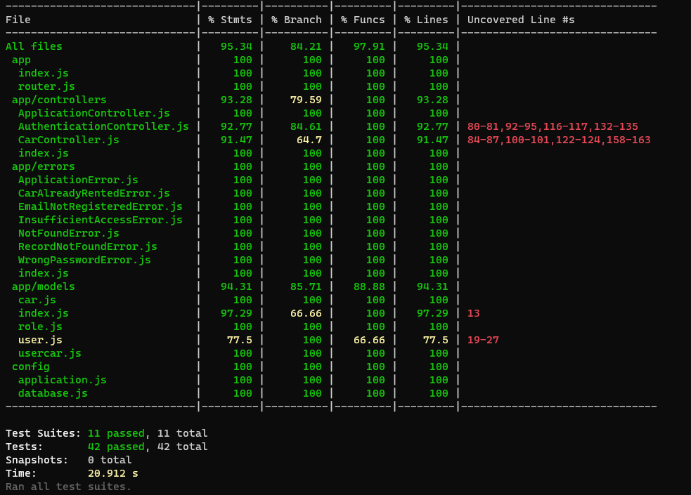

# Challange-08 Binar Car Rental

## Description

this project is an individual challenge to make unit tests, integration tests and deploying this app using `railway.app`.

Unit and integration tests for this project is built using `jest` and `supertest`. and styling for this javascript project is enforced using ESLint.

## Running public APP

You can access this application on [https://challange-08-production.up.railway.app/](https://challange-08-production.up.railway.app/)

## Running Local APP

To run this application in your computer follow these steps.

### Setup Local Server, Database and Run Server

    yarn install

Run this command to install all dependencies.

    yarn setup

run this command to setup database with sequelize, Remember to setup `database` first;

## API Docs

| Route            |  Local Full URL           | Full URL Link                                                     |
| ---------------- | ---------------------------- | ------------------------------------------------------------- |
| `/documentation` | localhost:8000/documentation | https://challange-08-production.up.railway.app/documentation/ |

## Unit test and integration tests
    yarn test

To run unit tests and integration tests, use this command:

